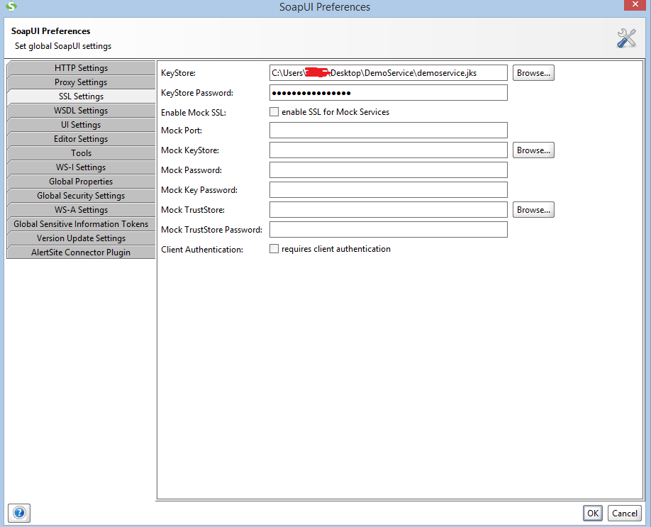
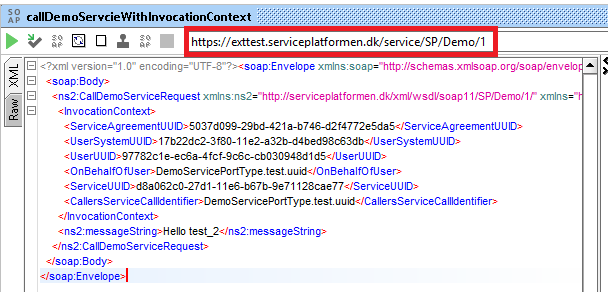
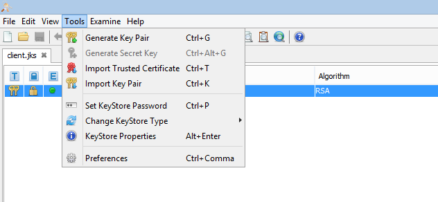
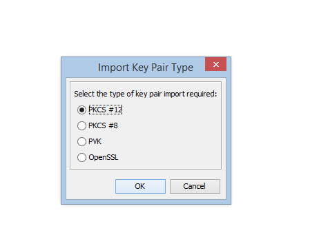
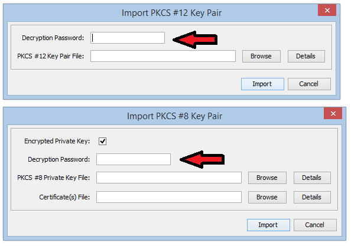

## PURPOSE

The intent of this project is to:
1. Make it easy to verify the connection to [KOMBIT Serviceplatformen](https://www.serviceplatformen.dk), 
using the authoritycontext and invocationcontext security models.
2. Serve as an example on how to implement and configure a client to KOMBIT Serviceplatformen for the 
authoritycontext and invocationcontext security models.

## TARGET AUDIENCE

This file is targeted at developers who implement integrations to Serviceplatformen.

## INSTRUCTIONS

### PREREQUISITES

 * SoapUI 5.2.1 or higher is installed.
 
The client is fully configured and should work as is. The client is tested with SoapUI.

### CONFIG

1.	Configure keystore
In SoapUI go to:
File -> Preferences -> SSL settings
-	Key Store field. Specify the path to demoservice.jks located in same folder as this document. (e.g -
`<Folder placement>\demoservice.jks`
-	Password -  `wRFsRP63H3kNEhDU`

2.	Set request’s URL to - https://exttest.serviceplatformen.dk/service/SP/Demo/1

### CHANGE CERTIFICATE

It may be desirable for a new Serviceplatformen user system to verify that a connection is possible using their own certificate.
To replace the dedicated DemoService certificate with a different one, with another tool than Keystore-Explorer the steps will vary,
but for Keystore-Explorer do the following:

1. Open `demoservice.jks` for the relevant client with KeyStore Explorer or your favorite JKS manipulation tool.
2. Remove the existing private-public key pair.
3. Import your own key pair.
* Tools -> Import Key Pair

4. Choose the key type you are importing.

5. Set a password and make sure the password for the key pair is the same as the password for the entire Java KeyStore file.

   If you have changed the demoservice.jks password, set the new password in SSL settings as descriped in CONFIG (above):

### CONTENT

There are couple of files in this archive:

- `readme.md` - this file.
- `DemoService-exttest-soapui-project.xml` - xml file represents SOAP UI project and can be imported by that tool.
- `demoservice.jks` - Certificate-file as descriped in CONFIG (above).
- `image\*` - images used for this readme.

The project contains two requests:
- `callDemoServcieWithInvocationContext`
- `callDemoServiceWithAuthorityContext`

### SIDENOTE
The SoapUI project does not contain an example request for the token security model. We instead refer to the Java client which can be found as a separate Serviceplatformen repository here on GitHub. 
The two other security models are covered in the SoapUI project.